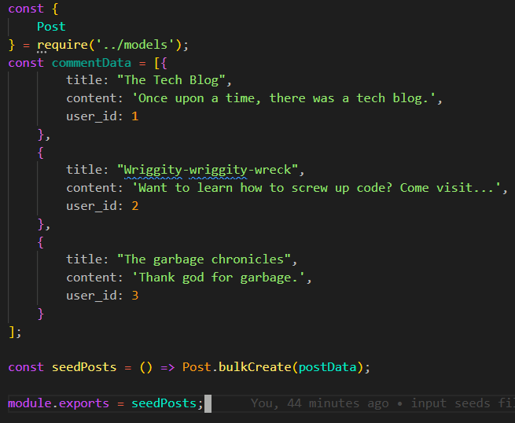
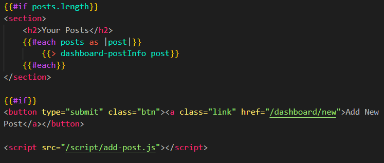

# Tech Blog

## Description

Tech Blog is a CMS-style blog site where developers can publish their blog posts
and comment on other developers' posts. This app follows the MVC paradigm,
utilizes handlebars as the templating language, Sequelize as the ORM, and the
express-session npm package for authentication.

## Table of Contents

[Technologies](#technologies)
[Prerequisites](#prerequisites)
[Installation](#installation)
[Usage](#usage)
[Licensing](#licensing)
[Project Status](#projectStatus)
[Contributing](#contributing)
[Acknowledgements](#acknowledgements)
[Questions](#questions)

## Technologies

- You are using a Linux, Mac or Windows machine.,\* You have a basic
  understanding of MVC paradigm, Javascript, Sequelize and Express.
  

## Prerequisites

Bcrypt, CSS, Express, Express-Handlebars, HTML, JavaScript, Sequelize, SQL

## Installation

To install this application: branch the Github Repo and clone the repo to your local machine.
If not already installed, you must install the node dependencies
by running npm install command in your terminal. Once completed,
you are ready to use the application!

## Usage

After installing the project, deploy to Heroku by

## Licensing

[APACHE] Licensed under the Apache License, Version 2.0(the 'License'); you may not use this file except in compliance with the License. You may obtain a copy of the License at 'http: //www.apache.org/licenses/LICENSE-2.0' Unless required by applicable law or agreed to in writing, software distributed under the License is distributed on an 'AS IS' BASIS, WITHOUT WARRANTIES OR CONDITIONS OF ANY KIND, either express or implied. See the License for the specific language governing permissions and limitations under the License.

## Project Status

Complete

## Contributing

Contribute to README Generator
To contribute to README Generator, follow these steps: 1. Fork this repository. 2. Create a branch: git checkout -b <branch name>. 3. Make your changes and commit them: git commit -m '<commit message>'. 4. Push to the original branch: git push origin <project_name/<location> 5. Create the pull request.
Alternatively, see the Github documentation on creating a pull request.

## Acknowledgements

TA's of the UC Davis Coding Bootcamp

## Sources

https://github.com/jakekelly44/tech-blog
https://github.com/treguv/tech-blog
https://www.npmjs.com/package/sequelize-typescript

## Questions

My name is Nikki Mounce
Reach me with additional questions: nikkicancode@gmail.com
Check out my GitHub: github.com/Nmounce
